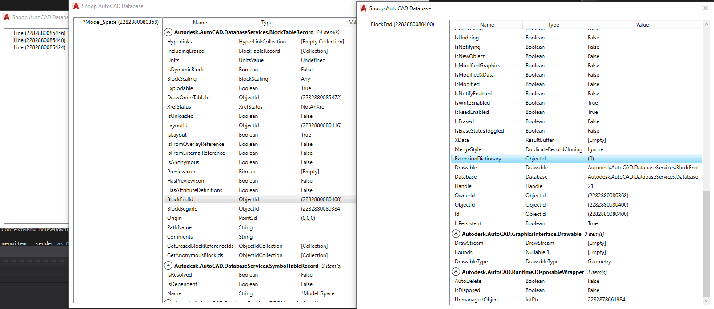

# AutoCADLookup

Interactive Autocad BIM database exploration tool to view and navigate element properties and relationships.

### Setup

Open the SnoopAutoCADCSharp.sln on Visual Studio 2022. All references should be ready for AutoCAD 2022 default install path, otherwise go to project properties >> References, then click on Reference Paths and adjust. Build the project in Release, the DLL should be placed at same folder. Copy the entire .bundle folder to C:\Program Files\Autodesk\Autodesk\ApplicationPlugins folder and launch Autocad.

## Installation

- Download last install stable(msi) from CadPythonShell [Release](https://github.com/chuongmep/CADPythonShell/releases/latest)
- Use command `Snoop` to open Window or use button Snoop from Ribbon
- See guide install detail at [How-to-Install-CadPythonShell](https://github.com/chuongmep/CadPythonShell/wiki/How-to-Install-CadPythonShell)

Note : Support for 4 last version(2019-2022) Autocad or Civil 3D. Older versions can be used but will not guarantee the expected performance.

# Usage

- On AutoCAD , command the "Snoop" option, the main form should appear. At the left side is a list of the main collections on the active document. On the right side, the properties of the item selected on the left.

- Can continue Snoop Database to check.

### Author 

First Project write sypport Autocad and Civi3D with language VB.NET by <a href="https://github.com/augustogoncalves">Augusto Goncalves</a> <a href="https://twitter.com/augustomaia">@augustomaia</a> , member of the Autodesk Developer Technical Services team.

Now project update in .NET C# by <a href="https://github.com/htlcnn">htlcnn</a> and <a href="https://github.com/chuongmep">Hồ Văn Chương</a> 

### Known Issues

The tool may stop working on some properties that cannot be reflected (using .NET).

### Demo

### Release History

1.0.0 : First Release

