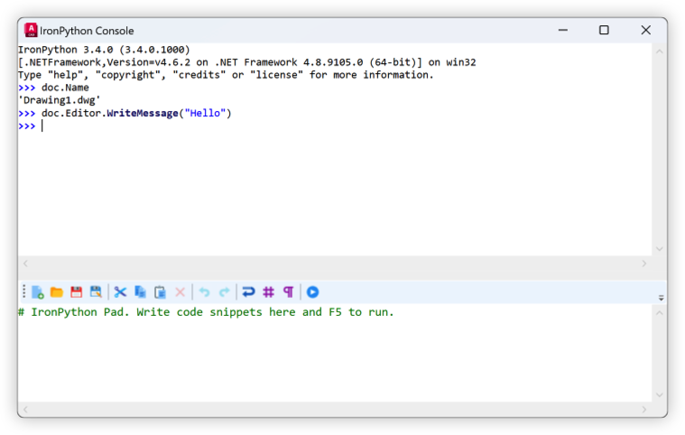
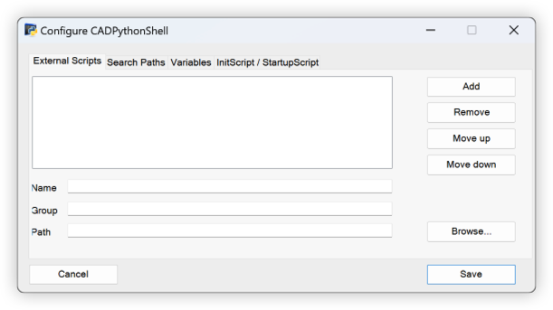
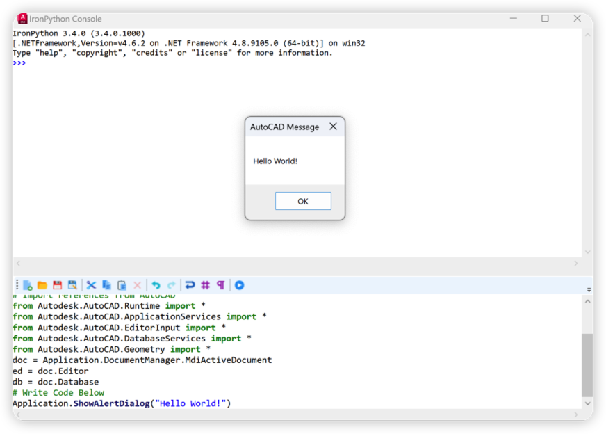
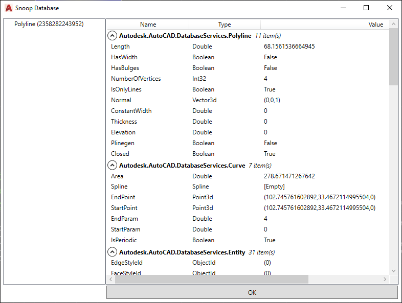
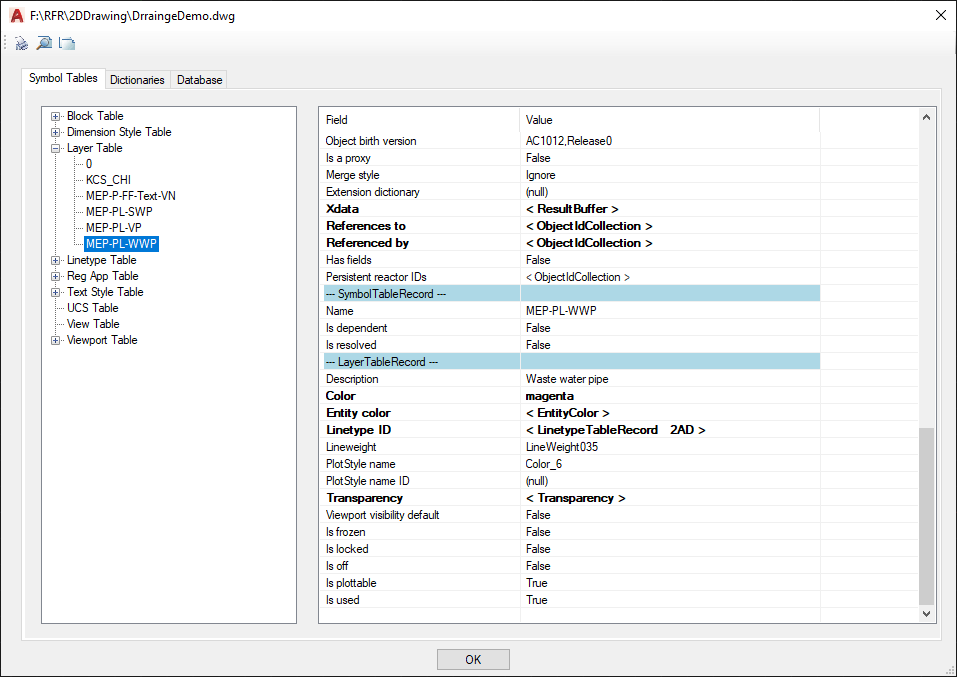
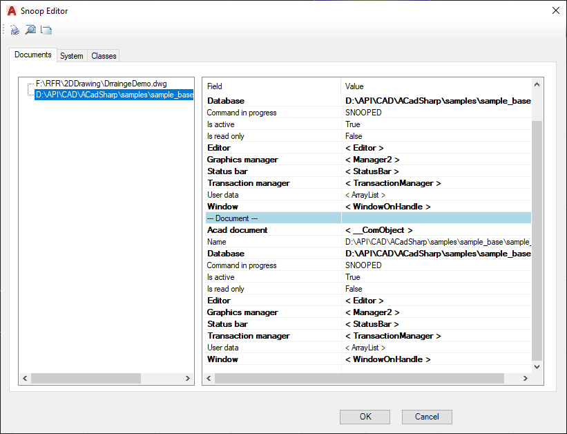
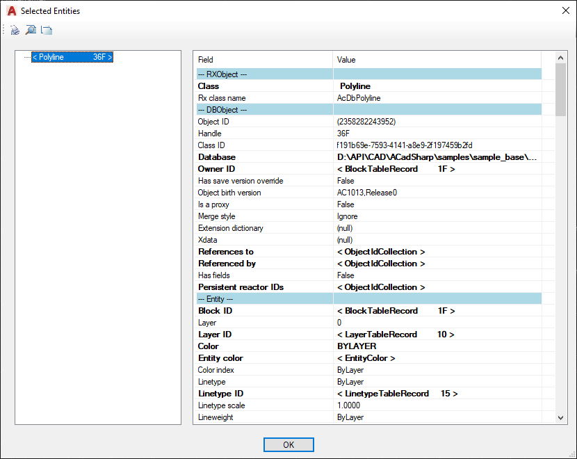
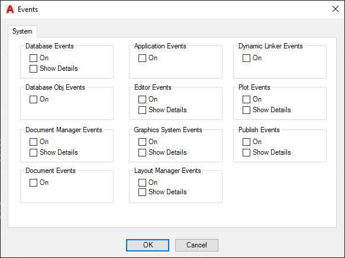

# CADPythonShell
  [](https://opensource.org/licenses/MIT)

   

[](../../actions)
[]()
[](http://hits.dwyl.com/chuongmep/CADPythonShell)
<a href="https://twitter.com/intent/follow?screen_name=chuongmep">
</a>

## Introduction

This is obviously a fork of [RevitPythonShell](https://github.com/architecture-building-systems/revitpythonshell), bringing an IronPython interpreter to Autodesk Autocad,
and it would not be possible without the great work of everyone involved with the RPS project. It's still pretty rough around the edges and provides only basic functionality at this time. I'm sharing my work so far, in the hopes that together we can expand it further.

The CADPythonShell (CPS) ,lets you to write plugins for Autocad in Python, provides you with an interactive shell that lets you see the results of your code *as you type it*. This is great for exploring the Autocad API.

The biggest limitation is that you can't deploy DLLs with custom scripts at this time and you can't subscribe to events at startup time.


## IronPython 3

IronPython 3.4 uses Python 3.4 syntax and standard libraries and so your Python code will need to be updated accordingly. There are numerous tools and guides available on the web to help porting from Python 2 to 3.

IronPython 3 targets Python 3, including the re-organized standard library, Unicode strings, and all of the other new features.with user upgrade from **IronPython 2** to **IronPython 3**, please follow [Upgrade from IronPython 2 to IronPython 3](https://github.com/IronLanguages/ironpython3/blob/master/Documentation/upgrading-from-ipy2.md).

Various differences between IronPython and CPython can follow at [Differences IronPython and CPython](https://github.com/IronLanguages/ironpython3/blob/master/Documentation/differences-from-c-python.md).

## Features

- Interactive IronPython interpreter for exploring the API
  - With syntax highlighting and autocompletion (in the console only)
  - Based on the [IronLab](http://code.google.com/p/ironlab/) project
- Batteries included! (Python standard library is bundled as a resource in the `CADRuntime.dll`)
- Full access to the .NET framework and the Autocad and Civil3D API
- Configurable "environment" variables that can be used in your scripts
- Save "external scripts" for reuse and start collecting your awesome hacks!
- Run scripts at Autocad or Civil startup
- Full **Snoop** info object Autocad or Civil3D (Database,Editor,Entity,etc,..)
- Interactive Snoop from console with IronPython
## Installation

- Download last install stable(msi) from [Release](https://github.com/chuongmep/CADPythonShell/releases/latest)
- Use command `PythonConsole` to open Console or use command `PythonShellSetting` to open form setting
- See guide install detail at [How-to-Install-CadPythonShell](https://github.com/chuongmep/CadPythonShell/wiki/How-to-Install-CadPythonShell)

Note : Support for 5 last version(2019-2023) Autocad or Civil 3D. Older versions can be used but will not guarantee the expected performance.


## Basic Usage CadPythonShell

- <kbd>PythonConsole</kbd> - Open Python Console



- <kbd>PythonShellSetting</kbd> - Open Setting Config Console



Use Snoop In Python Shell In Python Script :

- <kbd>Snoop</kbd> - Quick Snoop Object Sample In CAD or Civil3D
- <kbd>sn.Snoop(obj)</kbd> - Snoop Object by Python Console In CAD or Civil3D
- <kbd>snoop(obj)</kbd> - Snoop Object by Python Console or Execute python code In CAD or Civil3D

Write Console Sample In Console :

``` py
ed = doc.Editor
ed.WriteMessage("Hello")
```


Create Script Execute `ShowAlertDialog` Demo :

```py
import clr
clr.AddReference('acmgd')
clr.AddReference('acdbmgd')
clr.AddReference('accoremgd')
# Import references from AutoCAD
from Autodesk.AutoCAD.Runtime import *
from Autodesk.AutoCAD.ApplicationServices import *
from Autodesk.AutoCAD.EditorInput import *
from Autodesk.AutoCAD.DatabaseServices import *
from Autodesk.AutoCAD.Geometry import *
doc = Application.DocumentManager.MdiActiveDocument
ed = doc.Editor
db = doc.Database
# Write Code Below
Application.ShowAlertDialog("Hello World!")
```



Create Script Execute `ShowAlertDialog` Demo :


Note : you can see more example in folder [Script Examples](https://github.com/chuongmep/CadPythonShell/tree/dev/Script%20Examples)

## Basic Usage Snoop



- <kbd>SnoopDB</kbd> - Snoop Database In CAD or Civil3D



- <kbd>SnoopEd</kbd> - Snoop Editor In CAD or Civil3D



- <kbd>SnoopEnts</kbd> - Snoop Entities In CAD or Civil3D



- <kbd>SnoopNEnts</kbd> - Snoop Entities Nested In CAD or Civil3D

- <kbd>SnoopByHandle</kbd> - Snoop By Handle In CAD or Civil3D


- <kbd>SnoopEvents</kbd> - Snoop Follow Events In CAD or Civil3D



## Contribute

- Don't hesitate to file any issues you stumble uppon. (Tho I don't guarantee I'll be able to solve them all for you)

## Getting started:

Learn some python:

  * [Python W3schools](https://www.w3schools.com/python/python_intro.asp)
  * [Python Basic](https://www.python.org/about/gettingstarted/)

Learn about the Autocad API:

  * ADN [Autodesk Developer Network](https://www.autodesk.com/developer-network/overview)
  * [The Autocad SDK"](https://www.autodesk.com/developer-network/platform-technologies/autocad/objectarx)
   

## License

This project is licensed under the terms of the [MIT License](http://opensource.org/licenses/MIT).
## Sponsors


Thanks for providing a free All product IDE for this project.

## Credits

  * Daren Thomas (original RPS Developer) [RPS](https://github.com/architecture-building-systems/revitpythonshell)
  * Joe Moorhouse (interactive shell was taken from his project [IronLab](https://code.google.com/archive/p/ironlab/)
  * [Dimitar Venkov](https://github.com/dimven/NavisPythonShell) (original port to Navisworks)
  * [ChuongMep](https://github.com/chuongmep) (original port to Autocad)
  * The rest of the RPS contributors
  * [Nice 3 Point](https://github.com/Nice3point) for process CI/CD
  * [Icon 8](https://icons8.com/) Free Wiki icons in various UI design styles for web, mobile
  * [htlcnn](https://github.com/htlcnn) origin of project AutocadLookup
  * [Autodesk Developer Network](https://github.com/ADN-DevTech/MgdDbg) project `MgdDbg` support full snoop database in Autocad.
